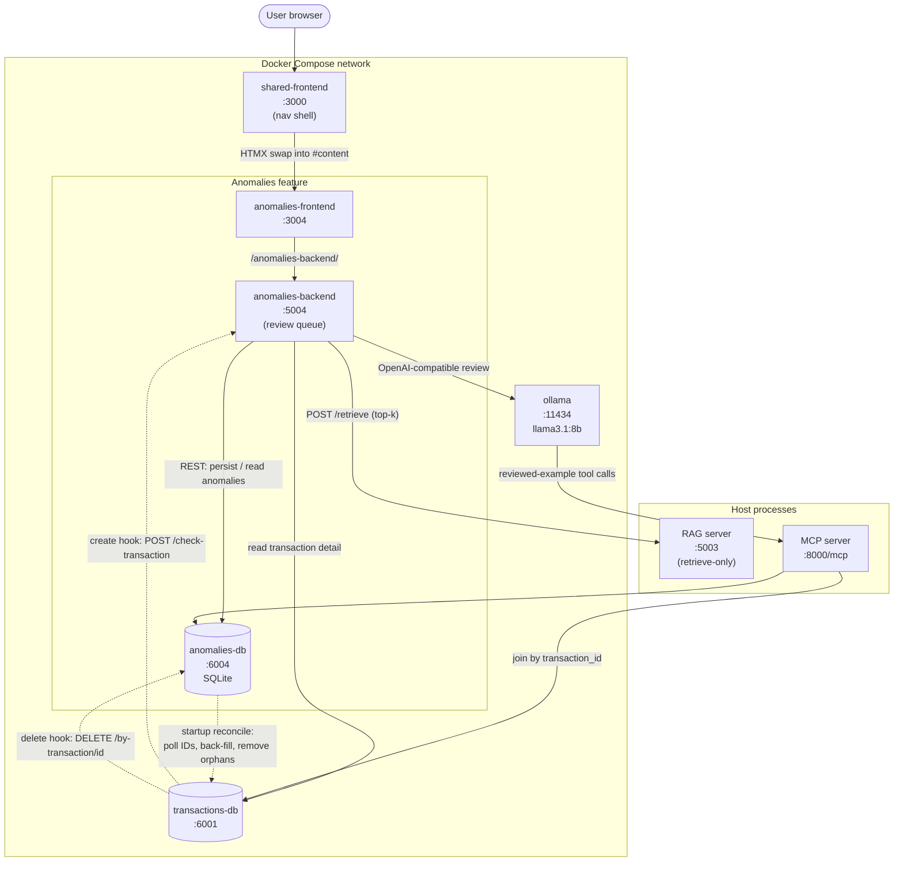

# Release 1 - Anomalies Software Architecture Design

Release 1 extends the anomaly-detection feature with retrieval-augmented
grounding (RAG) and MCP tool access. This document describes the individual
software architecture of the Anomalies feature: the shared frontend shell, the
three Anomalies containers, the shared Ollama model host, and the host-side RAG
and MCP servers.

## Container topology

The feature is deployed through Docker Compose. It is composed of three
Anomalies-owned containers (`anomalies-frontend`, `anomalies-backend`,
`anomalies-db`), the shared `shared-frontend` shell, and the shared `ollama`
model host. Two further services — the **RAG server** and the **MCP server** —
run as host processes rather than Compose services and are reached over
`host.docker.internal`.

Solid arrows are the live request path; dotted arrows are the cross-database
sync mechanisms (create/delete hooks and the startup reconcile) that stand in
for the missing foreign key.

## Shared frontend container

`shared-frontend` (`shared/frontend`, port `3000`) is the single entry point
the user loads. It renders the navigation shell and proxies each feature's
frontend. The Anomalies tab is wired with `ANOMALIES_FRONTEND_URL =
http://anomalies-frontend:3004`, and the shell loads the module via an HTMX
`innerHTML` swap into `#content`. Because that swap drops the fragment's
`<head>`, the Anomalies frontend keeps its styles inside the `<body>` so they
survive the swap.

## Anomalies containers

### `anomalies-frontend` (:3004)

Serves the Anomalies UI — the anomaly list, review controls, confidence
display, and confirm/dismiss actions. It proxies backend calls through
`/anomalies-backend/` using `ANOMALIES_BACKEND_URL =
http://anomalies-backend:5004`, and long-polls `/anomaly-alert` so a newly
detected anomaly surfaces to the user as a toast.

### `anomalies-backend` (:5004)

The orchestration service. It exposes `POST /check-transaction` (queue a
transaction for asynchronous review) and `GET /anomaly-alert` (long-poll for a
completed review), and it drives the Plan–Act–Observe–Adapt review loop. Its
dependencies are configured as:

| Variable | Value | Purpose |
| --- | --- | --- |
| `ANOMALIES_DB_URL` | `http://anomalies-db:6004/anomalies` | Persist and read anomaly records. |
| `TRANSACTIONS_DB_URL` | `http://transactions-db:6001` | Read transaction detail. |
| `OLLAMA_URL` / `OLLAMA_MODEL` | `http://ollama:11434/v1`, `llama3.1:8b` | OpenAI-compatible model calls. |
| `MCP_SERVER_URL` | `http://host.docker.internal:8000/mcp` | Reviewed-example tools (via the model). |
| `RAG_SERVER_URL` / `RAG_FEATURE` / `RAG_TOP_K` | `http://host.docker.internal:5003`, `anomalies`, `3` | Retrieval grounding. |

A background worker processes the review queue so transaction creation is never
blocked on model latency.

### `anomalies-db` (:6004)

A Flask + SQLAlchemy REST API over a SQLite file (`/app/data/anomalies.db`) on a
persistent volume. Each anomaly stores its related `transaction_id` (unique —
one anomaly per transaction), the agent's reason, the user's confirmation
status, a confidence score, and retrieval sources. Because transactions and
anomalies live in separate databases, the relationship is a logical ID rather
than an enforced cross-database foreign key. The database reconciles against the
transactions service on startup (`RECONCILE_MAX_RETRIES = 30`,
`RECONCILE_RETRY_DELAY_SECONDS = 2`): it polls for valid transaction IDs,
back-fills missing anomalies, and removes orphans so the two stores stay
eventually consistent.

## Shared Ollama host

`ollama` (port `11434`) is the shared model host for every feature. The
Anomalies backend calls it through an OpenAI-compatible client using
`llama3.1:8b`. During review, Ollama is the component that issues the MCP tool
calls to retrieve reviewed examples.

## RAG server (host process, :5003)

The retrieve-only RAG server (`ai-services/rag-server`) grounds the detection
agent with reference documents. The backend's `rag_client` requests
`POST /retrieve` with the `anomalies` feature and the current transaction,
returning the top `k` matches. Every failure is surfaced as a safe `RAGError`
and callers degrade gracefully, so a RAG outage never blocks anomaly detection.
Because it runs on the host, it is reached at `http://host.docker.internal:5003`.

## MCP server (host process, :8000)

The MCP server (`ai-services/mcp-server/server.py`) runs as a host process and
is reached at `http://host.docker.internal:8000/mcp`. It reads
`TRANSACTIONS_DB_URL` and `ANOMALIES_DB_URL` to access the transaction and
anomaly APIs, and exposes two reviewed-anomaly tools:

| Tool | Purpose |
| --- | --- |
| `get-transactions-with-confirmed-anomalies` | Transactions whose anomalies the user confirmed as suspicious. |
| `get-transactions-with-rejected-anomalies` | Transactions whose anomalies the user rejected as false positives. |

Each result joins the transaction and anomaly records by `transaction_id` and
excludes anomalies whose transaction no longer exists. Confirmed results act as
positive examples and rejected results as negative examples; the current
transaction is still evaluated on its own supplied fields.

## Review flow

1. The transactions backend relays a newly created transaction to
   `POST /check-transaction`, which queues it and returns immediately.
2. A background worker sends the current transaction to Ollama, grounded with
   RAG reference documents.
3. Ollama calls both reviewed-anomaly MCP tools to retrieve prior decisions.
4. Ollama evaluates the transaction and returns a structured JSON finding.
5. The backend validates the finding and persists suspicious results, with a
   confidence score, to the anomalies database.
6. The frontend long-poll surfaces the result, and the user confirms or rejects
   it — feeding the next review through the MCP tools.

## Related documentation

- [Anomalies overview](../../../aiden/README.md)
- [Frontend documentation](../../../aiden/frontend/README.md)
- [Backend documentation](../../../aiden/backend/README.md)
- [Database documentation](../../../aiden/database/README.md)
- [Test documentation](../../../aiden/test/README.md)
